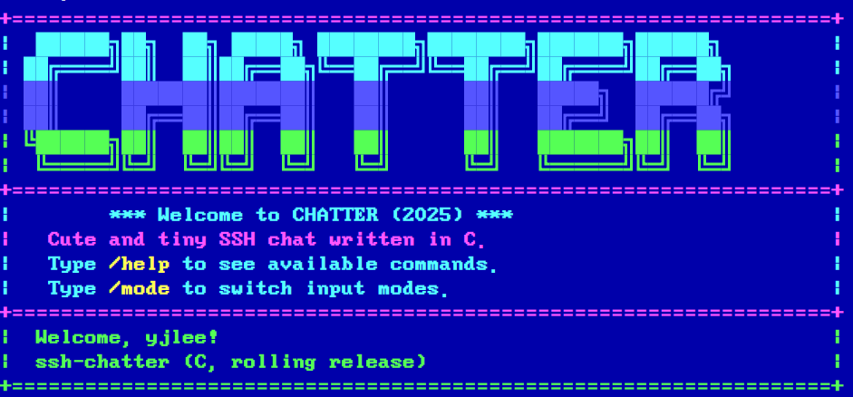

# SSH-Chatter


SSH-Chatter has started from a C reimplementation of the Go [`ssh-chat`](https://github.com/shazow/ssh-chat) server.  It mirrors/extends the original behaviour while using modern C patterns and a small, testable core.  The server listens for SSH connections and places every authenticated user into a shared chat room that exposes the same command surface as the Go reference implementation.

> [!IMPORTANT]
> **✨ Highlights from the latest builds**
> - Named polls got quality-of-life upgrades: run `/vote <label> <question>|<choices...>` for multi-choice ballots, or `/vote-single <label> <question>|<choices...>` when you only need one pick.
> - `/eliza-chat` now keeps shared memories in `eliza_memory.dat`, letting everyone continue a persistent conversation with the resident Eliza persona.
> - Follow communities from inside the terminal with the `/rss` reader (`/rss list`, `/rss read <tag>`, operators manage feeds with `/rss add <url> <tag>` and `/rss del <tag>`).

## Recent enhancements

- Named poll management via `/vote` for multiple-choice polls (vote with `/1 <label>` or `/elect <label> <choice>`) plus `/vote-single` for classic single-choice runs, including graceful shutdown with `/vote @close <label>`.
- Terminal-friendly RSS reader accessible with `/rss list`, `/rss read <tag>`, plus `/rss add <url> <tag>` and `/rss del <tag>` (operators only) so the room can browse headlines together.
- Shared eliza memory store powering `/eliza-chat <message>`, letting everyone chat with the eliza persona while grounding replies in prior conversations persisted to `eliza_memory.dat`.
- Background BBS watchdog thread that uses the Gemini/Ollama moderation backends to remove posts that advertise crimes or harmful material, plus `/delete-msg` for targeted chat history cleanup.
- Poll state persistence to `vote_state.dat` (overridable via `CHATTER_VOTE_FILE`) so active polls and their votes survive restarts.
- `/bbs` command unlocking a retro bulletin board system with tags, comments, bumping, and a multi-line composer that ends on a `>/__BBS_END>` terminator.
- `/asciiart` live composer with a 128-line limit, a ten-minute per-IP cooldown, multi-line output, and keyboard shortcuts for cancelling with Ctrl+A and submitting with Ctrl+S or `>/__ARTWORK_END>`.
- `/birthday` to register birthdays, `/soulmate` to find matching dates, `/grant <ip>` so LAN operators can delegate privileges by address, and `/revoke <ip>` so top LAN admins can reclaim them.
- Chat UI refresh with a clean divider between history and input, instant input clearing after send, and a friendly "Wait for a moment..." banner with a playful loading bar before each join.
- Friendly multilingual captcha featuring easy comparisons and language-based name counts.
- Expanded nickname support for non-Latin characters plus `/ban` upgrades that accept raw IP addresses alongside usernames.
- Profile status updates via `/status <message|clear>` and `/showstatus <username>`, plus `/weather <region> <city>` for quick global forecasts.

# Preview


## Repository layout

The codebase is intentionally compact so new contributors can navigate it quickly:

| Path | Description |
|------|-------------|
| `main.c` | Command-line parsing and process bootstrap (bind address, port, MOTD, host key directory). |
| `lib/host.c`, `lib/headers/host.h` | Chat host implementation – session lifecycle, MOTD handling, and hooks for future message broadcast logic. |
| `lib/headers/contexts` | Definitions for `session_ctx_t` and related structures that encapsulate per-connection state. |
| `scripts/install_chatter_service.sh` | Convenience installer that builds the binary, installs it under `/usr/local/bin`, and wires up a `systemd` unit (`chatter.service`). |
| `scripts/install_dependencies.sh` | Minimal package installer for build prerequisites on Debian/Ubuntu systems. |

## Staying current with `main`

The `work` branch regularly diverges from upstream development so larger features can
incubate without interrupting production traffic. When it is time to synchronize with
`main`, pull the latest tree and merge it locally before opening a pull request:

```bash
git fetch origin main
git checkout work
git merge --no-ff origin/main
```

Resolve any conflicts in place (the `lib/host.c` helper routines already mirror the
layout used on `main`, so merges are typically straightforward) and run `make` to
confirm the build still succeeds before pushing the result.

## Automation hooks

- `host_snapshot_last_captcha` exposes the most recently generated captcha prompt and answer along with a timestamp so external clients can pass challenges on behalf of unattended automation.

## Security hardening

- `scripts/safe_permission.sh` tightens the ownership and mode on runtime data files (BBS state, vote state, cooldown snapshots, and general chatter state). Run it after deployment to confine the data directory to `ssh-chatter` and to ensure each file is set to `0600`. Override the targets by passing explicit paths or by exporting `STATE_ROOT` or the corresponding `CHATTER_*_FILE` environment variables before execution.
- A background BBS watchdog periodically feeds posts and comments through the AI moderation pipeline (Gemini primary with Ollama fallback). Flagged posts are removed automatically and a notice is broadcast to the room.
- Chat messages, ASCII art, and BBS posts/comments flow through a layered security filter. ClamAV scans the payload first (defaulting to `clamscan --no-summary --stdout -`, overridable with `CHATTER_CLAMAV_COMMAND` or disabled with `CHATTER_CLAMAV=off`). AI-based moderation is now opt-in—enable it with `CHATTER_SECURITY_AI=on` to query Gemini (`GEMINI_API_KEY`) with an automatic Ollama fallback (`http://127.0.0.1:11434` by default). Disable the entire feature with `CHATTER_SECURITY_FILTER=off`. If every provider fails, the filter automatically disables itself to avoid blocking conversations while misconfigured.
- Suspicious submissions that trip the layered filter are now tracked per-IP; repeated hits trigger an automatic kick and ban, while the rapid reconnect detector allows longer recovery windows so unstable network sessions can rejoin without being penalized.

## Prerequisites

Building the project requires a POSIX environment with:

- A C11 compatible compiler (e.g. `gcc` or `clang`)
- `make`
- `libssh` development headers and library (`libssh-dev` on Debian/Ubuntu)
- `libcurl` development headers and library (`libcurl4-openssl-dev` on Debian/Ubuntu)
- POSIX threads (usually supplied by the system `libpthread`)

On Debian/Ubuntu the dependencies can be installed with:

```bash
sudo apt-get update
sudo apt-get install build-essential libssh-dev libcurl4-openssl-dev
```

## Building from source

Clone the repository and use the provided `Makefile`:

```bash
make
```

This produces an `ssh-chatter` binary in the repository root and a `libssh_chatter_backend.so` shared object that exposes the
translation helpers for reuse in other applications.  Clean intermediate artifacts with `make clean`.

### Using the shared translation backend

The shared object reuses the server's C translation pipeline (including ANSI placeholder preservation) so other processes can
obtain translations without spawning the full SSH host.  Link against `libssh_chatter_backend.so` and include
`lib/headers/ssh_chatter_backend.h`:

```c
#include "lib/headers/ssh_chatter_backend.h"

int main(void) {
  char translated[4096];
  char detected[64];

  if (ssh_chatter_backend_translate_line("Hello, world!", "ko", translated, sizeof(translated), detected, sizeof(detected))) {
    printf("Detected %s -> %s\n", detected, translated);
  }
}
```

Set `GEMINI_API_KEY` (and optionally `GEMINI_API_BASE` or `GEMINI_MODEL`) in the environment so the helper can reach the Google Generative Language API, mirroring the runtime requirements of the main daemon.  You can run `./scripts/test_gemini_connection.sh` before launching the chat server to verify that the credentials allow outbound calls; the script prints the raw Gemini response so you can see whether the request succeeded.

## Running the server manually

The server defaults to listening on `0.0.0.0:2222`.  You can adjust runtime parameters with the available flags:

```
Usage: ./ssh-chatter [-a address] [-p port] [-m motd_file] [-k host_key_dir] [-T telnet_port|off]
       ./ssh-chatter [-h]
       ./ssh-chatter [-V]
```

When provided, `-m` reads the message of the day from the specified file path.

Common examples:

```bash
# Start the chat server on port 2022, loading host keys from /etc/ssh
./ssh-chatter -p 2022 -k /etc/ssh

# Enable telnet access on 0.0.0.0:4242 alongside SSH
./ssh-chatter -T 0.0.0.0:4242

# Serve a custom MOTD from a file and bind to localhost
./ssh-chatter -a 127.0.0.1 -m /etc/ssh-chatter/motd
```

The host key directory must contain an `ssh_host_rsa_key` file (and optional `.pub`).  Generate one with `ssh-keygen -t rsa -b 4096 -f /path/to/dir/ssh_host_rsa_key` if you do not want to reuse your system SSH host keys.  Additional host keys named `ssh_host_ed25519_key` and `ssh_host_ecdsa_key` are loaded automatically when present so the server can offer modern algorithms during key exchange.

### Connecting as a client

Once running, connect with any SSH client:

```bash
ssh -p 2222 user@server-address
```

The public server is available at `chat.korokorok.com` on the default SSH port:

```bash
ssh -p 22 yourname@chat.korokorok.com
```

Usernames provided at the SSH prompt are used as your chat nickname.

Telnet clients can join with the same feature set. Telnet listening is enabled by default on port `2323` and can be adjusted or disabled with the `-T` flag. Provide `-T address:port` to override the bind address (it inherits the SSH bind when omitted; use an empty host like `-T :4242` to listen on all interfaces). For example, to join over telnet from a retro terminal:

```bash
telnet server-address 2323
```

Pass `-T off` (or `-T disable`) to turn the telnet listener off entirely.

## Installing as a systemd service

A helper script is provided to automate installation on systems that use `systemd`:

```bash
sudo ./scripts/install_chatter_service.sh
```

What the script does:

1. Compiles the project (`make`).
2. Installs the resulting binary to `/usr/local/bin/ssh-chatter`.
3. Creates a dedicated `ssh-chatter` system user and group (if they do not already exist).
4. Creates `/var/lib/ssh-chatter` for runtime state (including the SSH host key) and `/etc/ssh-chatter` for configuration files.
5. Generates a default RSA host key under `/var/lib/ssh-chatter/ssh_host_rsa_key` when missing.
6. Creates a default MOTD at `/etc/ssh-chatter/motd` and an override file `/etc/ssh-chatter/chatter.env` for environment-based tuning.
7. Writes `/etc/systemd/system/chatter.service`, reloads `systemd`, enables the service, and starts it immediately.

The resulting `chatter.service` unit starts the server with sensible defaults and grants the `CAP_NET_BIND_SERVICE` capability so the non-root service account can bind to privileged ports if required.

### Customising the service

You can adjust defaults by editing `/etc/ssh-chatter/chatter.env` and restarting the service:

```bash
sudo systemctl edit chatter.service   # or edit the environment file directly
sudo systemctl restart chatter.service
```

Supported environment variables include:

- `CHATTER_BIND_ADDRESS` – IP address to bind (default `0.0.0.0`).
- `CHATTER_PORT` – TCP port exposed to clients (default `2222`).
- `CHATTER_MOTD_FILE` – Path to the message-of-the-day file (default `/etc/ssh-chatter/motd`).
- `CHATTER_HOST_KEY_DIR` – Directory containing `ssh_host_rsa_key` (default `/var/lib/ssh-chatter`).
- `CHATTER_EXTRA_ARGS` – Additional arguments appended to the `ssh-chatter` invocation.
- `CHATTER_VOTE_FILE` – Path to the vote state file (default `vote_state.dat`).
- `CHATTER_GEMINI_COOLDOWN_FILE` – Path to the Gemini cooldown state file (default `gemini_cooldown.dat`).
- `CHATTER_ELIZA_MEMORY_FILE` – Path to the persistent eliza memory store (default `eliza_memory.dat`).
- `CHATTER_SECURITY_FILTER` – Set to `off`/`false`/`0` to disable the layered security filter (enabled by default).
- `CHATTER_SECURITY_AI` – Set to `on`/`true`/`1` to enable AI moderation (disabled by default).
- `CHATTER_CLAMAV` – Set to `off`/`false`/`0` to disable ClamAV scanning (enabled by default when `clamscan` is available).
- `CHATTER_CLAMAV_COMMAND` – Override the command used to feed payloads into ClamAV (default `clamscan --no-summary --stdout -`).

Translation support now relies on the Google Gemini API.  Set the following in `chatter.env` (or the environment) to enable it:

- `GEMINI_API_KEY` – Secret API key used to authenticate translation requests.
- `GEMINI_API_BASE` – Optional override for the API base URL (defaults to `https://generativelanguage.googleapis.com/v1beta`).
- `GEMINI_MODEL` – Optional override for the Gemini model name (defaults to `gemini-2.5-flash`).

When translation is active the chat delivers each message immediately in its original language and follows up with an indented
caption that contains the translated text once the Gemini response arrives.  Reaction summaries use the same caption styling so
updates appear directly beneath the message they reference.

If the inline caption inserts feel jarring you can reserve a small buffer of blank lines ahead of time with `/chat-spacing <0-5>`.
The setting only affects live chat threads—bulletin board content continues to translate without reservation—so you can tune the
spacing for your own session without impacting long-form posts.

Your translation toggle and language choices are saved in `chatter_state.dat`, so future sessions automatically restore the same
configuration once you reconnect.

If you prefer to install without immediately starting the service, run the script with `SKIP_START=1`.

Service management commands:

```bash
sudo systemctl status chatter.service
sudo systemctl restart chatter.service
sudo systemctl disable --now chatter.service
```

## Feature status

### Implemented

- SSH listener that negotiates connections and spawns a thread per session.
- Login Captcha
- MOTD delivery through the `-m` flag or service-managed configuration file.
- `/help` command for connected clients.
- Server-side logging of joins, parts, and administrative command attempts (`/ban`, `/poke`).
- Broadcasting chat messages to all connected participants.
- Color Palettes
- BBS-style personal message
- Media Tag
- Ban User
- Clock
- Nickname Changer
- Chat Scroll
- Checking user list
- Language Translation
- OpenWeather `/weather`
- Named polls with label-based voting, supporting multiple-choice `/vote` polls and single-choice `/vote-single` alternatives, including `/elect <label> <choice>` as a text-friendly voting shortcut.
- Retro bulletin board system accessible through `/bbs` with tagging, comments, bumping, and an interactive composer that ends with `>/__BBS_END>`.
- `/asciiart` editor with 128-line drafts, a ten-minute per-IP posting cooldown, multi-line delivery, and Ctrl+A/Ctrl+S shortcuts.
- `/game` hub featuring built-in `tetris` (transcoded from the original Soviet-era C implementation) and `liargame`, both suspendable via `/suspend!` or Ctrl+Z.

### In progress / planned
- Enforcing moderation commands beyond logging.

## Contributing

Issues and pull requests are welcome.  Please include reproduction steps for bugs and ensure `make` succeeds before submitting changes.
